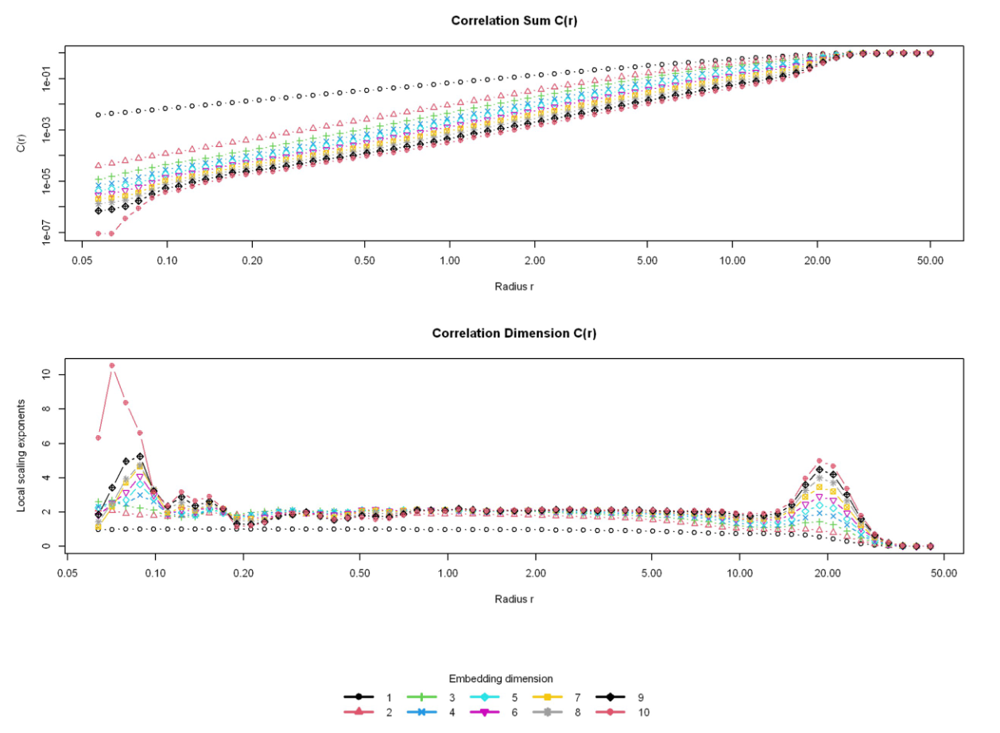

# Forecasting Chaotic Time Series Using Classical Dynamical Systems Methods

This project presents a compact baseline for forecasting chaotic time series using classical nonlinear techniques rooted in dynamical systems theory.

## The Problem

Forecasting chaotic time series is notoriously difficult due to their sensitive dependence on initial conditions and apparent stochasticity. While such series may look like noise, they are often generated by deterministic processes. 

This project explores classical nonlinear forecasting methods to analyze and predict such behavior, using a synthetic series that mimics real-world chaotic systems (e.g., weather, fluid dynamics, financial indicators). The goal is to demonstrate how phase space reconstruction and attractor-based forecasting can yield reliable short-term predictions in the presence of chaos.

## The Dataset

The data is a synthetic time series provided in a simple single-column text file as a sequence of scalar values. The time series consists of 5,000 consecutive observations.

## Methodology

**Data loading and visualization**: Visualized the data to gain an initial understanding of its structure and characteristics.

**Reconstruction of the phase space**: Estimated the Optimal Time Delay (τ) and the minimum embedding dimension in which the attractor can be unfolded without self-intersections.

**System dynamics exploration**: Used different algorithms to estimate the fractal dimension of the attractor underlying the time series, quantifying the complexity of the system and distinguishing between stochastic and deterministic chaos. Also estimated the maximal Lyapunov exponent to verify the presence of chaotic behavior in the system.

**Nonlinear prediction and error analysis**: Used the reconstructed attractor to forecast a future value of the time series using nearest-neighbors. The prediction was compared to the true value, and the relative error was calculated.

**Optimization**: Attempted to increase the embedding dimension of the attractor to compare prediction accuracy.

## Results and Key Takeaways

- The system exhibits a fractal attractor with a dimension estimated at 1.93.
- The minimum embedding dimension required to unfold the attractor is 5.
- The maximal Lyapunov exponent is positive, confirming chaotic dynamics.
- Nonlinear prediction achieves low relative error of 2.92%.
- Increasing the embedding dimension to 6 lowers error to 1.47%. While an embedding dimension of 5 suffices to unfold the attractor, the optimal embedding for forecasting may differ from the one needed for phase space reconstruction.

## Future Work

- Tune the radius and radius increment parameters.
- Try alternative prediction algorithms.
- Preprocess the time series (e.g., detrending, normalization).
- Include surrogate data testing, alternative embedding methods, or longer prediction horizons.

## Repository Contents

- `Timeseries_Notebook.ipynb`: The notebook that implements the end-to-end pipeline of the project, and also acts as a report.
- `w20.dat`: The input time series.

## Project Context

This project was developed as part of the Timeseries Forecasting course for the MSc in Data Science Programme at the International Hellenic University. 
